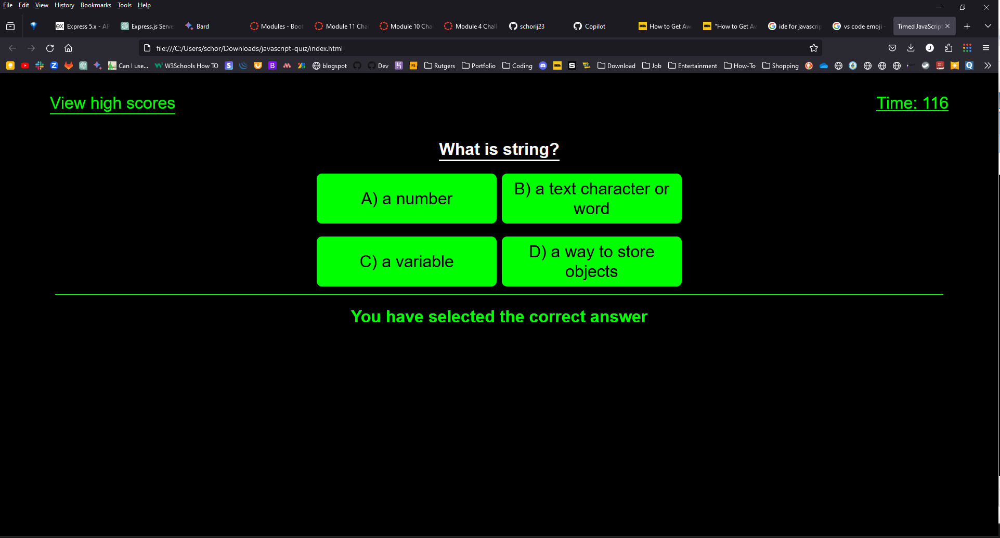

# JavaScript Coding Quiz

## Description
This is a simple javascript coding quiz using html5, css and javascript

## Table of Contents

* [Installations](#installations)
* [License](#license)
* [Questions](#questions)
* [Screenshots](#screenshots)

## Installations
This project requires an IDE 
[VS Code](https://code.visualstudio.com/) 
[Intellij](https://www.jetbrains.com/idea/) 
[Eclipse](https://eclipseide.org/) 

## License
The project is licensed by the MIT License.

For more details, see [License Details](https://choosealicense.com/licenses/mit/)

## Questions

  This is my contact information if there are any questions

  - GitHub User Name [GitHub](https://github.com/schorij23) 
  - Email address schorij23@gmail.com

## Screenshots

